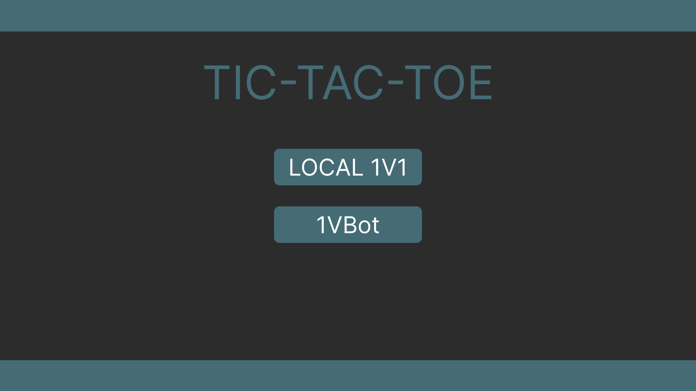
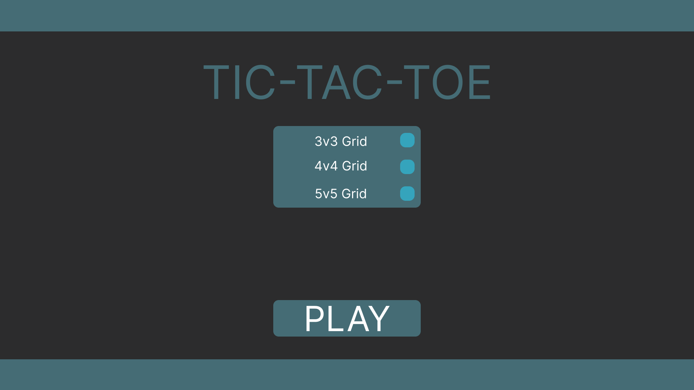
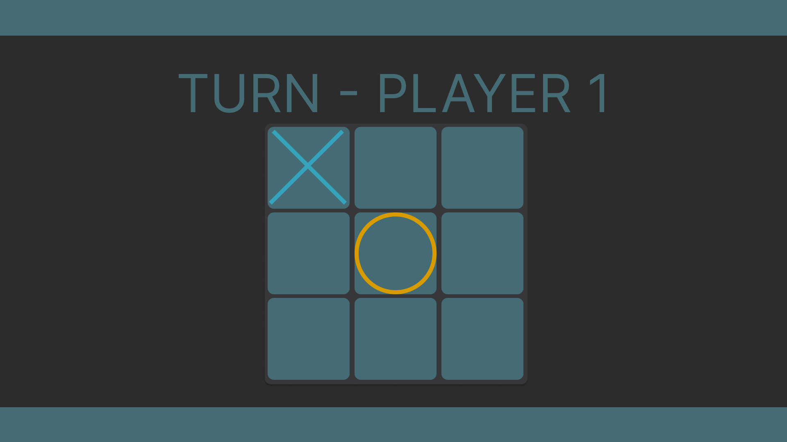
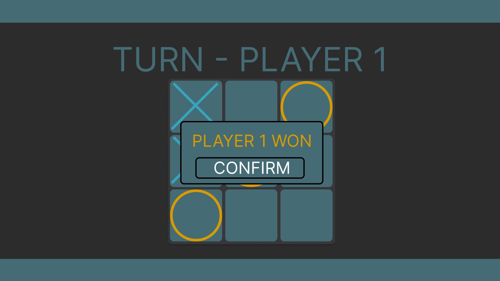
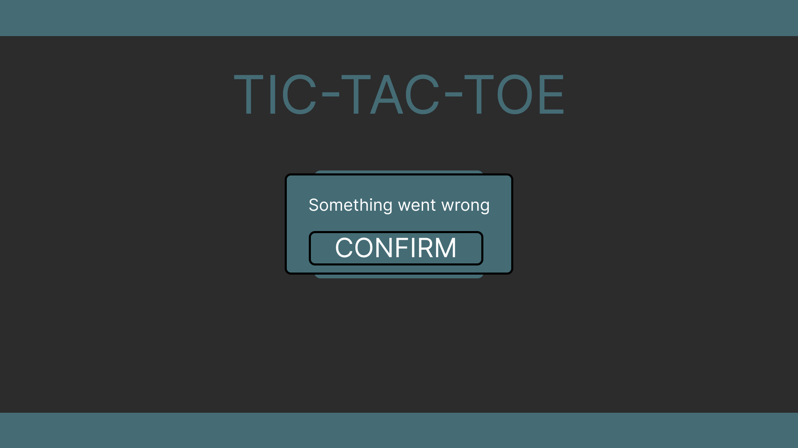

# Tic-Tac-Toe

- ## 1. Úvod

  - ### 1.1 Účel
    - Detailní popis funkcí a designu aplikace.
  - ### 1.2 Cílová skupina
    - Tento dokument je určený pro vývojáře, kteří chtějí vytvořit piškvorky aplikaci.
  - ### 1.3 Další dokumenty
    - SRS dokument v README.md
  - ### 1.4 Kontakty
    - Mail: vaskodaniel1@gmail.com

- ## 2. Scénáře
  - ### 2.1 Všechny reálné způsoby použití
    - Pouze jeden, běžný uživatel.
  - ### 2.2 Typy uživatelských rolí
    - Hráč: Možnost zapnout hru proti dalšímu lokálnímů uživateli či proti botovi
  - ### 2.3 Vyemezení rozsahu
    - V Tic-Tac-Toe bude možné hrát pouze lokálně proti jinému uživateli na stejném zařízení či proti botovi, bez možnosti uložení hry.
- ## 3. Celková hrubá architektura

  - ### 3.1 Pracovní tok

    - #### 3.1.1 Zapnutí hry 1v1 nebo 1vBot
      - Uvídí dvě tlačítka, **"LOCAL 1V1"** a **"1VBot"** **(viz obrázek 3.2.1)**, po stistknutí jednoho z těchto dvou tlačítek objeví se **"Herní nastavení"** **(viz obrázek 3.2.2)**, kde uživatel vybere typ pole (3x3,4x4,5x5) a zmáčkne PLAY tlačítko, které ho přesune do hry.
    - #### 3.1.2 Průběh hry
      - Hráč uvidí nahoře napsané kdo je na řadě **(viz obrázek 3.2.3)**. Po každém kliknutí na jedno z prázdných políček se zobrazí buď křížek nebo kolečko, podle toho jestli hraje hráč proti hráči (hráč 1 - kolečko, hráč 2 - křížek) nebo proti botovi (hráč 1 - kolečko, hráč 2 (Bot) - křížek). Pokud bude políčko již obsazeno, nic se nestane.
      - Pokud nějaký hráč dosáhne cíle, podle velikosti mapy (3x3 - 3 v řadě, 4x4 - 4 v řade, 5x5 - 5 v řade) zobrazí se box s textem kdo vyhrál a tlačítko **"CONFIRM"** pro přechod do hlavního meny **(viz obrázek 3.2.4)**.
    - #### 3.1.1 Error hry
      - Přesunou se do Hlavního menu a dostanou upozornění "Something went wrong" a tlačítko "CONFIRM" pro odstranění upozornění **(viz obrázek 3.2.4)**.

  - ### 3.2 Hlavní moduly
    - #### 3.2.1 Hlavní menu
      - Dvě tlačítka, "LOCAL 1v1" a "1VBot". Velký text "TIC-TAC-TOE".
      - 
    - #### 3.2.2 Herní nastavení
      - Tři možnosti velikosti mapy (checkboxy), "3x3", což bude defaultní možnost,"4x4" a "5x5", tlačítko "PLAY" pro přesun do hry.
      - 
    - #### 3.2.3 Hra
      - Text "TURN - PLAYER {number}", který zobrazuje jaký hráč je na řadě. Grid kostek podle vybrané velikosti mapy, který v sobě budou mít křížky, kroužky nebo prázdnotu.
      - 
      - Při dohrané hře se objeví nový, který píše text a tlačítko "CONFIRM", který přesune hráče zpátky do hlavního menu.
      - 
    - #### 3.2.4 Error
      - Při Erroru hry hře se objeví nový text "Something went wrong" a talčítko "CONFIRM", které zmizí po kliknutí tlačítka.
      - 
